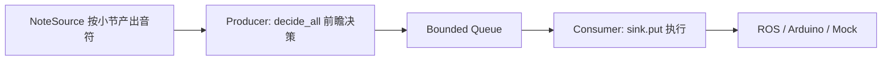

# 实时双线程骨架说明

> 对应代码：`violin_midi_json/src/violin_midi_json/streaming.py`
>
> 目的：为后续视觉识谱（OMR）接入预留稳定接缝，先定义线程边界和数据契约，不改现有离线转换主链路。

---

## 1. 背景与目标

老师建议的思路是经典生产者-消费者模型：

- 线程 A：读取一小节音符并完成处理；
- 线程 B：读取动作并执行。

本项目骨架采用这一思路，但强调一个关键边界：

- 线程切分点放在“决策之后、执行之前”；
- 队列里放的是“已完成运弓决策的动作”，不是原始音符。

这样可以保证：

- 生产侧只关心音乐和决策；
- 消费侧只关心执行（编码、发 ROS、发串口等）；
- 后续替换数据源或执行端时互不影响。

---

## 2. 骨架包含哪些对象

### 2.1 `ViolinAction`

线程间传递的最小动作单元（不可变）：

- `note: ConvertedNote`
- `decision: BowDecision`

含义：

- `note` 保留音符和指法信息；
- `decision` 保留弓向、连奏、弓速等决策结果。

### 2.2 `NoteSource`（输入接口）

音符来源抽象，要求按小节输出音符批次：

- `iter_measures() -> Sequence[Sequence[ConvertedNote]]`

可替换实现：

- 现在：离线 MIDI 分小节读取；
- 未来：视觉识谱实时输入。

### 2.3 `ActionSink`（输出接口）

动作去向抽象：

- `put(action: ViolinAction) -> None`
- `close() -> None`

可替换实现：

- 现在：写文件或 mock；
- 未来：ROS 发布、串口发送、硬件执行。

### 2.4 `RealtimePipeline`（双线程骨架）

负责拉起两个线程和中间有界队列：

- 生产者 `_produce()`：
  - 按小节读音符；
  - 调用 `BowDecisionEngine.decide_all(...)`；
  - 逐个动作 `queue.put(...)`。
- 消费者 `_consume()`：
  - `queue.get()` 拉取动作；
  - 调用 `sink.put(action)` 执行。

提供：

- `start()`：启动线程；
- `join()`：等待线程结束。

---

## 3. 线程安全与状态归属

这部分是骨架最重要的约束。

### 3.1 唯一共享状态

只有 `queue` 是线程间共享对象。

### 3.2 决策器状态归属

`BowDecisionEngine` 是有状态对象（上一音、上一弓向、当前弓位等），必须由生产者线程独占。

消费者线程不得读取或修改决策器内部状态。

### 3.3 不可变动作对象

队列中传递 `ViolinAction`（冻结 dataclass），防止消费侧误改数据，减少并发错误。

---

## 4. 为什么要用有界队列

骨架默认使用 `Queue(maxsize=64)`（可配置）。

意义：

- 当消费端变慢时，生产者会阻塞；
- 阻止无界积压导致延迟不断变大；
- 能更早暴露“执行跟不上”这一实时系统关键问题。

---

## 5. 当前范围与非目标

当前骨架是“结构就位”，不是“实时功能已完成”。

已完成：

- 线程边界和数据契约；
- 双线程运行框架；
- 结束哨兵机制（生产结束后通知消费者退出）。

尚未在骨架内实现：

- 真实视觉识谱输入；
- 墙钟同步调度（按绝对时间发布动作）；
- ROS/Arduino 实时发送策略；
- 异常恢复与重试策略。

---

## 6. 未来接入步骤（建议顺序）

1. 实现 `VisionScoreSource`：把 OMR 输出组织成按小节 `ConvertedNote` 批次。
2. 实现 `RobotRealtimeSink`：将 `ViolinAction` 编码并按时序发送到 ROS/Arduino。
3. 在集成层创建 `RealtimePipeline(source, engine, sink)` 并 `start()`。
4. 加入监控指标：队列长度、生产/消费速率、丢包与超时统计。

---

## 7. 与现有离线流程关系

离线流程保持不变：

- `converter.py` 继续负责 MIDI 到 JSON/BIN 的批处理转换。

实时骨架是增量扩展：

- 新增模块，不破坏当前 CLI 和离线输出；
- 同一套 `BowDecisionEngine` 可在离线和实时场景复用。

---

## 8. 简化时序图

---

## 9. 代码定位

- 骨架实现：`violin_midi_json/src/violin_midi_json/streaming.py`
- 包导出入口：`violin_midi_json/src/violin_midi_json/__init__.py`
